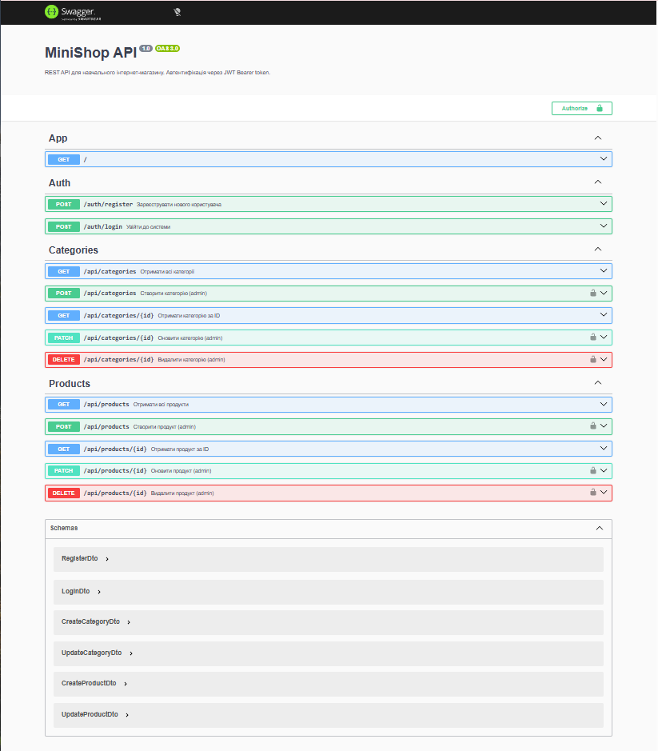

## Student
- Name: <Гіцевич Ярослав Геннадійович>
- Group: <232.1>
 
## Практичне заняття №6 — Interceptors + Exception Filters + Swagger
 
### Структура репозиторію
```
.
├── dist
├── node_modules
├── src/
│   ├── auth/
│   │   ├── dto/
│   │   │   ├── register.dto.ts
│   │   │   └── login.dto.ts
│   │   ├── auth.module.ts
│   │   ├── auth.service.ts
│   │   └── auth.controller.ts
│   ├── users/
│   │   ├── user.entity.ts
│   │   ├── users.module.ts
│   │   └── users.service.ts
│   ├── categories/
│   │   ├── dto/
│   │   │   ├── create-category.dto.ts
│   │   │   └── update-category.dto.ts
│   │   ├── category.entity.ts
│   │   ├── categories.module.ts
│   │   ├── categories.service.ts
│   │   └── categories.controller.ts
│   ├── products/
│   │   ├── dto/
│   │   │   ├── create-product.dto.ts
│   │   │   └── update-product.dto.ts
│   │   ├── product.entity.ts
│   │   ├── products.module.ts
│   │   ├── products.service.ts
│   │   └── products.controller.ts
│   ├── common/
│   │   ├── enums/
│   │   │   ├── role.enum.ts
│   │   │   └── user.entity.ts
│   │   ├── guards/
│   │   │   ├── jwt-auth.guard.ts
│   │   │   └── roles.guard.ts
│   │   ├── decorators/
│   │   │   ├── current-user.decorator.ts
│   │   │   └── roles.decorator.ts
│   │   ├── interceptors/
│   │   │   ├── logging.interceptor.ts
│   │   │   └── transform.interceptor.ts
│   │   ├── filters/
│   │   │   └── http-exception.filter.ts
│   │   └── pipes/
│   │   	└── trim.pipe.ts
│   ├── migrations/
│   │   ├── 1775655274575-CreateTables.ts
│   │   ├── 1775655787462-AddIsActiveToProducts.ts
│   │   └── 1777566032183-CreateUsers.ts
│   ├── app.controller.spec.ts
│   ├── app.controller.ts
│   ├── app.module.ts
│   ├── app.service.ts
│   ├── data-source.ts
│   └── main.ts
├── test/
├── .env
├── .env.example
├── .gitignore
├── .prettierrc
├── docker-compose.yml
├── Dockerfile
├── eslint.config.mjs
├── nest-cli.json
├── package-lock.json
├── package.json
├── README.md
├── swagger-screenshot.png
├── tsconfig.build.json
└── tsconfig.json
```
 
### Запуск проекту
```bash
cp .env.example .env
docker compose up --build
[4:55:24 PM] Starting compilation in watch mode...
app-1  | 
app-1  | [4:55:28 PM] Found 0 errors. Watching for file changes.
app-1  | 
app-1  | [Nest] 29  - 05/06/2026, 4:55:30 PM     LOG [NestFactory] Starting Nest application...
app-1  | [Nest] 29  - 05/06/2026, 4:55:30 PM     LOG [InstanceLoader] TypeOrmModule dependencies initialized +105ms
app-1  | [Nest] 29  - 05/06/2026, 4:55:30 PM     LOG [InstanceLoader] ConfigHostModule dependencies initialized +1ms
app-1  | [Nest] 29  - 05/06/2026, 4:55:30 PM     LOG [InstanceLoader] AppModule dependencies initialized +1ms
app-1  | [Nest] 29  - 05/06/2026, 4:55:30 PM     LOG [InstanceLoader] ConfigModule dependencies initialized +0ms
app-1  | [Nest] 29  - 05/06/2026, 4:55:30 PM     LOG [InstanceLoader] ConfigModule dependencies initialized +0ms
app-1  | [Nest] 29  - 05/06/2026, 4:55:30 PM     LOG [InstanceLoader] JwtModule dependencies initialized +1ms
app-1  | [Nest] 29  - 05/06/2026, 4:55:30 PM     LOG [InstanceLoader] CacheModule dependencies initialized +16ms
app-1  | [Nest] 29  - 05/06/2026, 4:55:31 PM     LOG [InstanceLoader] TypeOrmCoreModule dependencies initialized +76ms
app-1  | [Nest] 29  - 05/06/2026, 4:55:31 PM     LOG [InstanceLoader] TypeOrmModule dependencies initialized +0ms
app-1  | [Nest] 29  - 05/06/2026, 4:55:31 PM     LOG [InstanceLoader] TypeOrmModule dependencies initialized +0ms
app-1  | [Nest] 29  - 05/06/2026, 4:55:31 PM     LOG [InstanceLoader] TypeOrmModule dependencies initialized +1ms
app-1  | [Nest] 29  - 05/06/2026, 4:55:31 PM     LOG [InstanceLoader] UsersModule dependencies initialized +0ms
app-1  | [Nest] 29  - 05/06/2026, 4:55:31 PM     LOG [InstanceLoader] AuthModule dependencies initialized +1ms
app-1  | [Nest] 29  - 05/06/2026, 4:55:31 PM     LOG [InstanceLoader] CategoriesModule dependencies initialized +1ms
app-1  | [Nest] 29  - 05/06/2026, 4:55:31 PM     LOG [InstanceLoader] ProductsModule dependencies initialized +0ms
app-1  | [Nest] 29  - 05/06/2026, 4:55:31 PM     LOG [RoutesResolver] AppController {/}: +38ms
app-1  | [Nest] 29  - 05/06/2026, 4:55:31 PM     LOG [RouterExplorer] Mapped {/, GET} route +2ms
app-1  | [Nest] 29  - 05/06/2026, 4:55:31 PM     LOG [RoutesResolver] AuthController {/auth}: +0ms
app-1  | [Nest] 29  - 05/06/2026, 4:55:31 PM     LOG [RouterExplorer] Mapped {/auth/register, POST} route +1ms
app-1  | [Nest] 29  - 05/06/2026, 4:55:31 PM     LOG [RouterExplorer] Mapped {/auth/login, POST} route +0msapp-1  | [Nest] 29  - 05/06/2026, 4:55:31 PM     LOG [RoutesResolver] CategoriesController {/api/categories}: +1ms
app-1  | [Nest] 29  - 05/06/2026, 4:55:31 PM     LOG [RouterExplorer] Mapped {/api/categories, GET} route +0ms
app-1  | [Nest] 29  - 05/06/2026, 4:55:31 PM     LOG [RouterExplorer] Mapped {/api/categories/:id, GET} route +2ms
app-1  | [Nest] 29  - 05/06/2026, 4:55:31 PM     LOG [RouterExplorer] Mapped {/api/categories, POST} route +1ms
app-1  | [Nest] 29  - 05/06/2026, 4:55:31 PM     LOG [RouterExplorer] Mapped {/api/categories/:id, PATCH} route +1ms
app-1  | [Nest] 29  - 05/06/2026, 4:55:31 PM     LOG [RouterExplorer] Mapped {/api/categories/:id, DELETE} route +1ms
app-1  | [Nest] 29  - 05/06/2026, 4:55:31 PM     LOG [RoutesResolver] ProductsController {/api/products}: +0ms
app-1  | [Nest] 29  - 05/06/2026, 4:55:31 PM     LOG [RouterExplorer] Mapped {/api/products, GET} route +1ms
app-1  | [Nest] 29  - 05/06/2026, 4:55:31 PM     LOG [RouterExplorer] Mapped {/api/products/:id, GET} route +0ms
app-1  | [Nest] 29  - 05/06/2026, 4:55:31 PM     LOG [RouterExplorer] Mapped {/api/products, POST} route +1ms
app-1  | [Nest] 29  - 05/06/2026, 4:55:31 PM     LOG [RouterExplorer] Mapped {/api/products/:id, PATCH} route +0ms
app-1  | [Nest] 29  - 05/06/2026, 4:55:31 PM     LOG [RouterExplorer] Mapped {/api/products/:id, DELETE} route +1ms
app-1  | [Nest] 29  - 05/06/2026, 4:55:31 PM     LOG [NestApplication] Nest application successfully started +4ms
```
 
### Swagger UI
http://localhost:3000/api/docs
 

 
### Формат успішної відповіді
```json
{
  "data": [
    {
      "id": 1,
      "name": "iPhone 16",
      "description": null,
      "price": "899.99",
      "stock": 50,
      "isActive": true,
      "category": {
        "id": 1,
        "name": "Electronics",
        "description": "Gadgets and devices",
        "createdAt": "2026-04-26T15:38:12.817Z"
      },
      "createdAt": "2026-04-26T15:38:41.138Z",
      "updatedAt": "2026-04-26T15:39:03.903Z"
    },
    {
      "id": 2,
      "name": "MacBook Pro",
      "description": null,
      "price": "2499.99",
      "stock": 10,
      "isActive": true,
      "category": null,
      "createdAt": "2026-04-30T17:21:23.892Z",
      "updatedAt": "2026-04-30T17:21:23.892Z"
    }
  ],
  "statusCode": 200,
  "timestamp": "2026-05-06T17:06:14.075Z"
}
```
 
### Формат помилки
```json
{
  "error": {
    "code": 401,
    "message": "Invalid credentials",
    "traceId": "8af2c3dc-b44f-48ae-8174-acbb19b67c44"
  },
  "timestamp": "2026-05-06T17:09:15.248Z"
}
```
 
### Приклад логів (LoggingInterceptor)
```text
app-1       | [Nest] 29  - 05/06/2026, 5:04:03 PM     LOG [HTTP] GET /api/products/ — 200 — 23ms
```
 
### Тест помилки з traceId
```text
{"error":{"code":404,"message":"Product #999 not found","traceId":"5292ae24-3599-4682-940e-1c91d7e7a289"},"timestamp":"2026-05-06T16:59:36.215Z"}
```